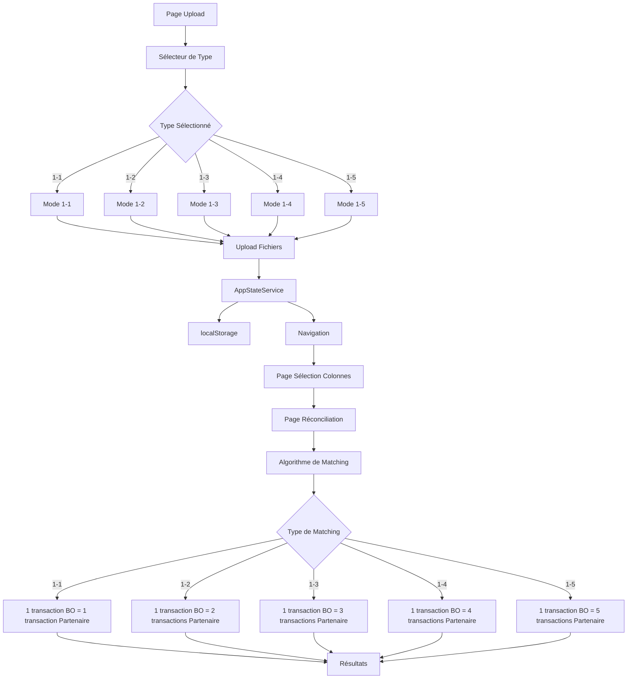

# Architecture de la Réconciliation Paramétrable

## Diagramme de l'Architecture

## Composants Implémentés

### 1. FileUploadComponent
- **Propriétés**: `reconciliationType`, `reconciliationMode`
- **Méthodes**: `onReconciliationTypeChange()`, `onProceed()`
- **Fonctionnalités**: 
  - Sélection du type de réconciliation
  - Upload des fichiers BO et Partenaire
  - Validation des données
  - Navigation vers la sélection des colonnes

### 2. AppStateService
- **Méthodes**: `setReconciliationType()`, `getReconciliationType()`
- **Fonctionnalités**:
  - Gestion de l'état global de l'application
  - Persistance du type de réconciliation
  - Stockage des données de réconciliation

### 3. Interface Utilisateur
- **Section d'information**: Explication du mode 1-1
- **Sélecteur de type**: Radio buttons pour choisir le type
- **Styles modernes**: Indicateurs visuels et animations
- **Réinitialisation**: Nettoyage automatique lors du changement de type

## Flux de Données

1. **Sélection du Type**: L'utilisateur choisit le type de réconciliation
2. **Sauvegarde**: Le type est sauvegardé dans AppStateService et localStorage
3. **Upload**: Les fichiers BO et Partenaire sont uploadés
4. **Validation**: Les données sont validées selon le type sélectionné
5. **Navigation**: L'utilisateur est dirigé vers la sélection des colonnes
6. **Réconciliation**: L'algorithme de matching est appliqué selon le type
7. **Résultats**: Les résultats sont affichés avec les correspondances appropriées

## Types de Réconciliation

| Type | Description | Algorithme |
|------|-------------|------------|
| 1-1 | Correspondance exacte | 1 transaction BO = 1 transaction Partenaire |
| 1-2 | Correspondance multiple | 1 transaction BO = 2 transactions Partenaire |
| 1-3 | Correspondance triple | 1 transaction BO = 3 transactions Partenaire |
| 1-4 | Correspondance quadruple | 1 transaction BO = 4 transactions Partenaire |
| 1-5 | Correspondance quintuple | 1 transaction BO = 5 transactions Partenaire |

## Avantages de cette Architecture

1. **Flexibilité**: Support de différents types de réconciliation
2. **Extensibilité**: Facile d'ajouter de nouveaux types
3. **Persistance**: Le type sélectionné est conservé entre les sessions
4. **Validation**: Chaque type peut avoir ses propres règles de validation
5. **Interface**: Interface utilisateur intuitive et moderne
